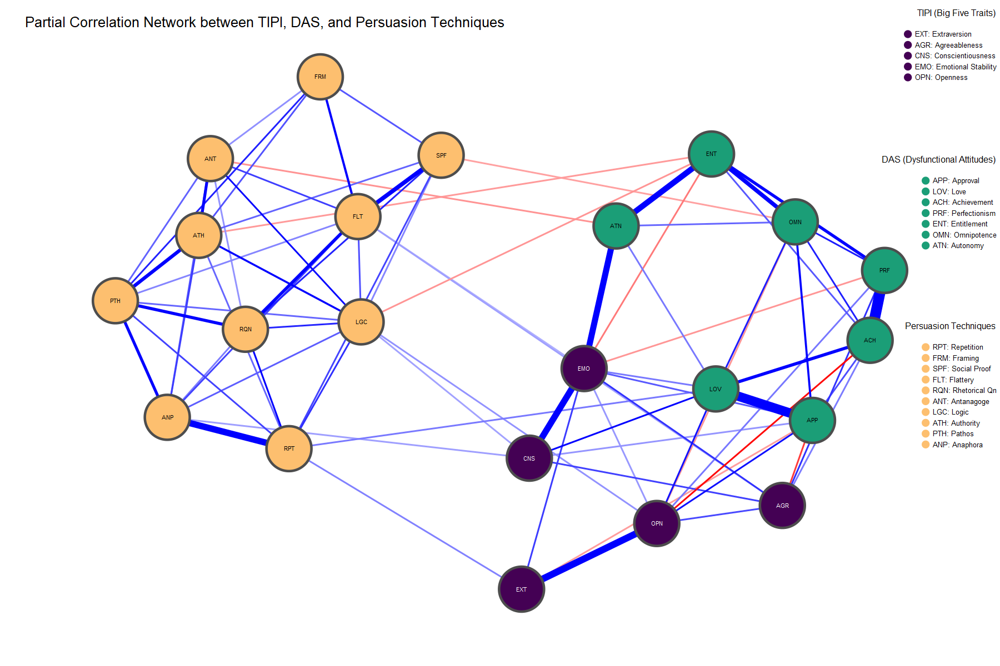
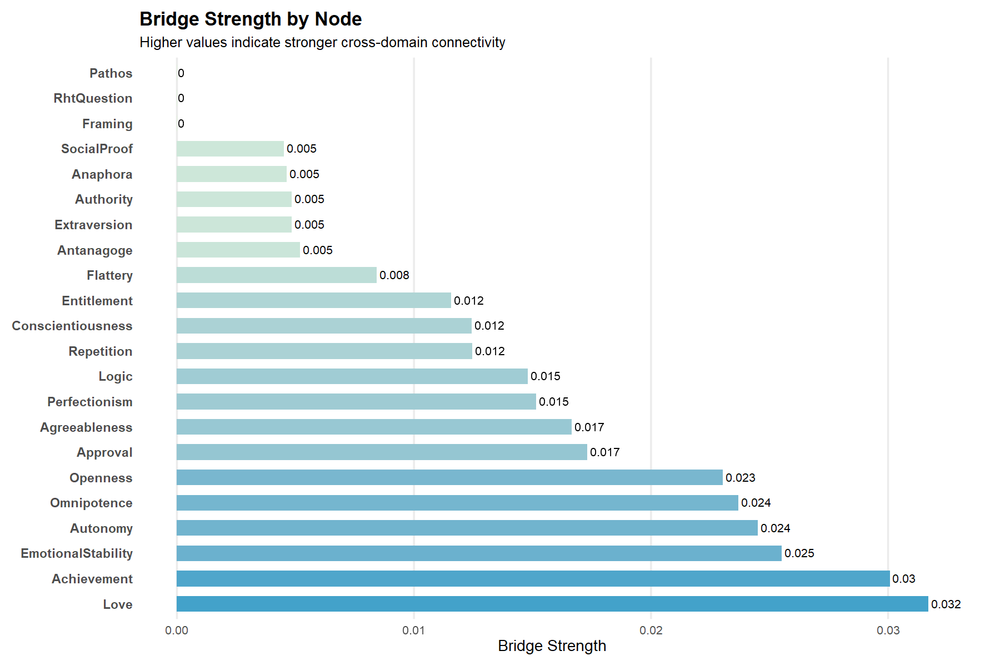

```{r setup, include=FALSE}
knitr::opts_chunk$set(echo = TRUE, warning = FALSE, message = FALSE)
```

# **Introduction**

This project uses publicly available data from Mendeley Data:

**Survey data on dysfunctional attitudes, personality traits, and agreement with** 
**persuasive techniques.**  

🔗 [Dataset link](https://data.mendeley.com/datasets/6jpdxs8p2y/6)

This dataset includes:

- **Ten Item Personality Inventory (TIPI)** – Gosling et al. (2003)

- **Dysfunctional Attitude Scale (DAS)** – Arlene Weissman, based on Burns (1980s)

- **Responses to persuasion techniques** (Braca & Dondio, 2022)

- **Demographic information** (e.g., age, gender, education)

There are three versions of the data set: **individual items**, **raw** and **reverse-coded**.  

For this analysis, we will **use the dataset-individual items.xlsx**, 
*(dataset-individual items.xlsx)*.

Due to concerns about data integrity, we opted to use the dataset containing
individual item-level responses (dataset-individual items.xlsx) instead of the 
pre-scored versions provided. Our team initially conducted analyses using the
reverse-scored dataset but encountered unexpected results, particularly unusual 
correlations among the Big Five traits. 

Upon cross-checking with the item-level dataset, we discovered that several TIPI 
items had not been reverse-scored correctly in the provided file. To ensure 
accuracy and transparency, we therefore chose to manually compute all trait scores 
from the raw individual items, applying the appropriate reverse scoring procedures 
ourselves.


# **Data Loading and Cleaning**

```{r, warning = FALSE, message = FALSE}
# Load required packages
library(tidyverse)
library(janitor)
library(stringr)
library(readxl)
```

## *Load and Clean*
```{r}
# load
  df <- read_excel("dataset-individual items.xlsx")
  
  # str(df) # structure
  # summary(df) # quick stats
  sum(is.na(df)) # check na values, none
  
  # clean names with janitor package
  df <- clean_names(df)
```

### TIPI

TIPI Scoring Scale: Items 2,4,6,8, and 10 were reverse scored. 
Then, we make composite score for each Personality Trait.
```{r}
# reverse scoring for tipi and compisite scores for TIPI
df2 <- df %>%
  mutate(
    # Reverse-scoring TIPI items (on 1–7 Likert scale)
    tipi6 = 8 - tipi6,   # Extraversion
    tipi2 = 8 - tipi2,   # Agreeableness
    tipi8 = 8 - tipi8,   # Conscientiousness
    tipi4 = 8 - tipi4,   # Emotional Stability 
    tipi10 = 8 - tipi10, # Openness

    # TIPI composites
    Extraversion = (tipi1 + tipi6) / 2,
    Agreeableness = (tipi2 + tipi7) / 2,
    Conscientiousness = (tipi3 + tipi8) / 2,
    EmotionalStability = (tipi4 + tipi9) / 2,
    Openness = (tipi5 + tipi10) / 2
  )
```


### DAS

Dysfunctional Attitude Scale (DAS) consists of 35 questions that aim to measure 
beliefs associated with Approval, Love, Achievement, Perfectionism, Entitlement, 
Omnipotence, and Autonomy. The first five questions correspond to the Approval 
attitude (1–5), followed by Love (6–10), Achievement (11–15), Perfectionism (16–20), 
Entitlement (21–25), Omnipotence (26–30), and Autonomy (31–35).

It is important to note that for this DAS scale, a **higher score** represents a 
**lower dysfunctional attitude** (i.e. A negative score reflects a potential area of 
emotional vulnerability, whereas a positive score suggests psychological resilience
or strength in that particular belief domain.)


```{r}
df3 <- df2 %>%
 mutate(
    Approval      = rowSums(select(., das1:das5)),
    Love          = rowSums(select(., das6:das10)),
    Achievement   = rowSums(select(., das11:das15)),
    Perfectionism = rowSums(select(., das16:das20)),
    Entitlement   = rowSums(select(., das21:das25)),
    Omnipotence   = rowSums(select(., das26:das30)),
    Autonomy      = rowSums(select(., das31:das35))
  )
```


### Persuasive Techniques

Participants were exposed to persuasive messages across three contexts, and
we will retain the first context only for our network analysis. 

We retained context 1: 
**Context 1: Encouraging subscriptions to credible news sources.**

```{r}
df4 <- df3 %>%
  select(49, 52, 55, 58, 61, 64, 67, 70, 73, 76, 79:90) %>%
  rename(
    Framing = t1_d1, # rename for clarity
    SocialProof = t2_d1,
    Flattery = t3_d1,
    RhtQuestion = t4_d1,
    Antanagoge = t5_d1,
    Logic = t6_d1,
    Authority = t7_d1,
    Pathos = t8_d1,
    Repetition = t9_d1,
    Anaphora = t10_d1
  )

# relocate for better clarity
df4 <- df4 %>%
  relocate(Extraversion, Agreeableness, Conscientiousness,
           EmotionalStability, Openness, .before = everything()) %>%
  relocate(Approval, Love, Achievement, Perfectionism,
           Entitlement, Omnipotence, Autonomy, .after = Openness) %>% 
  relocate(Repetition, Framing, SocialProof, Flattery,
           RhtQuestion, Antanagoge, Logic, Authority, Pathos, Anaphora,
           .after = last_col())
```


# **EDA: Explorartory Data Analyses**
```{r, warning = FALSE, message = FALSE}
# Load required packages
library(psych)
library(ggplot2)
library(corrplot)
```

## *Descriptive Statistics*
```{r}
psych::describe(df4)[, c("mean", "sd", "skew", "kurtosis")]
```

We examined the distributions of key variables (Big Five personality traits and 
DAS subscales) using skewness and kurtosis statistics.

Skewness reflects the symmetry of a distribution, with values between -1 and +1 
considered ideal, and values between -2 and +2 still generally acceptable (Hair et al., 2022).
Kurtosis reflects the shape of the distribution, where values close to 0 indicate a
distribution similar to normal. Values beyond ±2 suggest a distribution that is
either overly peaked or too flat.

All variables in this dataset fall within the acceptable ranges of skewness and kurtosis,
suggesting that the distributions are approximately normal and appropriate for 
subsequent analysis.


## *Histograms to double check normality*
```{r}
df4 %>%
  select(Extraversion:Anaphora) %>%
  pivot_longer(cols = everything(), names_to = "Variable", values_to = "Score") %>%
  ggplot(aes(x = Score, fill = Variable)) +
  geom_histogram(bins = 20, alpha = 0.7, color = "white", show.legend = FALSE) +
  facet_wrap(~ Variable, scales = "free") + # use facet wrap here to combine all
  theme_minimal() +
  labs(title = "Distributions of Personality and DAS Traits")
```


## *Correlation Plot*
```{r}
cor_matrix <- cor(df4, use = "complete.obs", method = "pearson")

corrplot(cor_matrix,
         method = "circle",         
         type = "lower",           
         tl.cex = 0.3,              
         addCoef.col = "black",     # add correlation coefficients
         number.cex = 0.4,          
         title = "Pearson Correlation Matrix")
```

The Pearson correlation matrix revealed mostly weak-to-moderate relationships across
variables, with stronger associations observed within domains (e.g., between specific 
DAS subscales).


# **Gaussian Graphical Model: Partial Correlation Network**

```{r, warning = FALSE, message = FALSE}
# load required packages
library(qgraph)
library(bootnet)
library(viridis)
library(viridisLite)
library(Cairo)
```

## *Network Estimation with ggmodselect*

We will use the ggmodselect which is more suitable given the large sample size 
(n = 1995). Unlike EBICglasso, which tends to overly shrink weaker edges, ggmodselect 
aims to retain meaningful associations and improve overall model fit. This makes
it ideal for detecting nuanced relationships across psychological domains.

The ggmodselect model search aims for model fit and accuracy, making it 
especially valuable in psychological networks where partial dependencies may not
always be sparse, and theoretical constructs are often interconnected across domains.

While skewness and kurtosis values were within acceptable ranges, item distributions
were based on ordinal Likert-type responses.

Thus, Spearman correlations were used for network estimation to ensure robust,
rank-based partial correlations that better reflect the ordinal nature of the 
data and reduce sensitivity to non-normality.

Estimate Network with `ggmodselect`
```{r}
network_ggmodselect <- estimateNetwork(df4,
                                    default = "ggmModSelect", 
                                    corMethod = "spearman")
network_ggmodselect_mat <- getWmat(network_ggmodselect)

summary(network_ggmodselect)
```


## *Beautifying with `qgraph`*

Since qgraph only supports a flat legend, we manually stack multiple legend() 
calls to create a "legend within a legend" — one for node labels and one for their
broader groupings.

This lets us show both variable names and their conceptual categories (e.g.,
TIPI, DAS, Persuasion Techniques) in a clean, organised way.

```{r}
# base legend labels (variables)
legend_labels <- c(
  "EXT" = "EXT: Extraversion",
  "AGR" = "AGR: Agreeableness",
  "CNS" = "CNS: Conscientiousness",
  "EMO" = "EMO: Emotional Stability",
  "OPN" = "OPN: Openness",
  "APP" = "APP: Approval",
  "LOV" = "LOV: Love",
  "ACH" = "ACH: Achievement",
  "PRF" = "PRF: Perfectionism",
  "ENT" = "ENT: Entitlement",
  "OMN" = "OMN: Omnipotence",
  "ATN" = "ATN: Autonomy",
  "RPT" = "RPT: Repetition",
  "FRM" = "FRM: Framing",
  "SPF" = "SPF: Social Proof",
  "FLT" = "FLT: Flattery",
  "RQN" = "RQN: Rhetorical Qn",
  "ANT" = "ANT: Antanagoge",
  "LGC" = "LGC: Logic",
  "ATH" = "ATH: Authority",
  "PTH" = "PTH: Pathos",
  "ANP" = "ANP: Anaphora"
)

legend_colors <- c(
  rep("#440154", 5),    # TIPI
  rep("#1b9e77", 7),    # DAS
  rep("#fdbf6f", 10)    # Persuasion
)

# nodel labels for each category 
TIPI_labels <- legend_labels[c("EXT", "AGR", "CNS", "EMO", "OPN")]
TIPI_colors <- legend_colors[1:5]

DAS_labels <- legend_labels[c("APP", "LOV", "ACH", "PRF", "ENT", "OMN", "ATN")]
DAS_colors <- legend_colors[6:12]

PERS_labels <- legend_labels[c("RPT", "FRM", "SPF", "FLT", "RQN", "ANT", "LGC", "ATH", "PTH", "ANP")]
PERS_colors <- legend_colors[13:22]


# plot network
CairoPNG("network_grouped_legend_style.png", width = 1800, height = 1200, res = 150)


qgraph(network_ggmodselect_mat,
       layout = "spring",
       labels = names(legend_labels),
       color = legend_colors,
       edge.color = ifelse(getWmat(network_ggmodselect) > 0, "blue", "red"),
       edge.width = 0.5, # if you want to show the values, include `edge.labels`
       curve = 0.3,
       label.cex = 0.4,
       vsize = 5,
       borders = TRUE, 
       border.color = "grey30",
       border.width = 1.5,
       fade = TRUE,
       minimum = 0,
       title = "Partial Correlation Network between TIPI, DAS, and Persuasion Techniques",
       legend = FALSE)

# TIPI group
legend(
  "topright",
  legend = "TIPI (Big Five Traits)",
  text.font = 1,
  bty = "n",
  cex = 0.6,
  inset = c(0, 0)
)
legend(
  "topright",
  inset = c(0, 0.035),
  legend = TIPI_labels,
  col = TIPI_colors,
  pch = 19,
  pt.cex = 1,
  cex = 0.5,
  bty = "n"
)

# DAS group (shifted slightly below TIPI)
legend(
  "topright",
  legend = "DAS (Dysfunctional Attitudes)",
  text.font = 1,
  bty = "n",
  cex = 0.6,
  inset = c(0, 0.22) # adjust accordingly to your graph/png!
)
legend(
  "topright",
  inset = c(0, 0.255),
  legend = DAS_labels,
  col = DAS_colors,
  pch = 19,
  pt.cex = 1,
  cex = 0.5,
  bty = "n"
)

# Persuasion Techniques group (stacked immediately below DAS)
legend(
  "topright",
  legend = "Persuasion Techniques",
  text.font = 1,
  bty = "n",
  cex = 0.6,
  inset = c(0, 0.47)
)
legend(
  "topright",
  inset = c(0, 0.505),
  legend = PERS_labels,
  col = PERS_colors,
  pch = 19,
  pt.cex = 1,
  cex = 0.5,
  bty = "n"
)

dev.off()
```

### Network Graph with Grouped Legend
```{r, echo = FALSE}

```


The network estimated using `ggModSelect()` revealed a more interpretable structure 
compared to the traditional EBICglasso approach. While EBICglasso is known for 
its conservative edge selection, the model selection approach adopted here retained
a greater number of meaningful partial correlations, allowing for a clearer depiction
of conditional dependencies across domains. Thus, we used ggmodselect as our final
algorithm.

Notably, the resulting network revealed limited cross-domain connectivity, with 
only weak partial correlations observed between personality traits (TIPI), dysfunctional
attitudes (DAS), and persuasion techniques.

One of the strongest within-domain connections was between Love and Approval
(*r* = 0.37), both from the DAS. This reflects a close link between the need 
for unconditional love and the desire for external validation—two belief systems 
that may reinforce one another. Even stronger was the edge between Perfectionism 
and Achievement (*r* = 0.41), again within DAS.

Another notable edge emerged between the TIPI and DAS domains was between Emotional
Stability and Autonomy (*r = 0.28*). This means that individuals with higher 
emotional stability—those who are generally calm, secure, and less anxious—also
tend to feel a greater sense of autonomy. In other words, being emotionally 
steady may support one’s confidence in making independent decisions and feeling 
less reliant on external approval or control.

A weak yet psychologically meaningful, cross-domain edge was detected between
Love and Repetition (*r = 0.08*). This subtle association may suggest
that individuals with a strong desire for love and acceptance might also be more
receptive to repeated messages.

Within the persuasion domain, Repetitiveness and Anaphora (*r = 0.29*) were correlated.
This suggests that individuals who find repeated messaging persuasive may als
o respond favourably to stylistic repetition at the sentence level—indicating a 
shared sensitivity to rhythm, emphasis, or familiarity in persuasive language.

Additionally, Social Proofing and repetitiveness were (*r = 0.22*) were also correlated,
suggesting those who are persuaded by the actions of others may also be more receptive 
to repeated messaging.

Despite these findings, most cross-domain edges—particularly those linking 
personality or DAS variables to persuasion techniques—were relatively weak, 
with partial correlations often below 0.2. This suggests that while some bridging 
relationships exist, they may not represent strong or direct pathways of influence, 
contrary to initial expectations.


# **Centrality Indices**

To better understand the role of individual variables within the network
structure, we examined two key centrality metrics; strength and betweenness. 
These metrics help identify which nodes are most influential in shaping the 
overall connectivity of the network. 

Betweenness centrality, on the other hand, measures how often a node lies 
on the shortest path between other nodes, indicating its importance as a
connector or "broker" within the network.

Closeness centrality was not included, as it assumes a high degree of overall
network connectivity, which is often not present in partial correlation networks.
Moreover, closeness can be unstable and difficult to interpret in networks with
disconnected or weakly connected components.


```{r}
centralityPlot(network_ggmodselect, include = c("Strength", "Betweenness"))
```

The centrality plot revealed that Love, Achievement, and Emotional Stability 
had the highest strength, suggesting these variables are consistently and strongly
linked to others. In terms of betweenness, Repetition, Entitlement, and Love 
emerged as key bridging nodes that may facilitate interactions between 
otherwise separate parts of the network.

However, while strength and betweenness provide insight into overall influence 
the network, they do not indicate whether a node specifically connects different
psychological domains—such as linking personality traits (TIPI) to persuasion 
techniques. To explore this, we turn to bridge centrality metrics, which are 
better suited for detecting cross-domain connectors and identifying nodes that 
may serve as points of influence between distinct constructs.


# **Bridge Strength**

To explore potential mediating nodes across psychological domains, bridge strength was
computed using the ggmodselect network. This metric identifies variables that serve 
as connectors between distinct communities (e.g., personality, dysfunctional attitudes,
persuasion). High bridge strength suggests these nodes may mediate or transmit 
influence across domains, positioning them as key psychological leverage points.

```{r, warning = FALSE, message = FALSE}
library(networktools)
library(igraph)
library(Cairo)
```


## *Spinglass community detection for Bridge Strength*

To detect bridge nodes while preserving the structure of both positive and
negative partial correlations, we used the Spinglass community detection algorithm, 
which is well-suited for weighted and signed networks. Unlike Walktrap, 
Spinglass accounts for edge signs during community detection.

Community labels from the Spinglass algorithm were then used in the bridge() 
function to calculate bridge centrality indices. This allowed us to identify 
nodes that serve as important connectors between otherwise distinct communities, 
capturing potential cross-domain influence or mediating roles.

```{r}
igraph_spinglass <-
  graph_from_adjacency_matrix(network_ggmodselect_mat,
                              mode = "undirected",
                              weighted = TRUE)

set.seed(4246)

communities <- spinglass.community(igraph_spinglass, 
                                   weights = E(igraph_spinglass)$Weight,
                                   implementation = "neg") # need to put neg here
# spinglass community detection considers edge weights.

community_labels <- membership(communities)

bridge_results <- bridge(network_ggmodselect_mat,
                         communities = community_labels,
                         normalize = TRUE)

plot(bridge_results)
```


## *Using `ggplot` to only plot bridge strength*
```{r}

# extract bridge strength and turn it into a df for ggplot
bridge_df <- data.frame(
  node = names(bridge_results[["Bridge Strength"]]),
  value = bridge_results[["Bridge Strength"]]
)

# clean node names (remove or replace spaces)
bridge_df$node <- gsub(" ", "\n", bridge_df$node)  # wrap long labels if needed

# arrange (descending, and factor the node variable) 
bridge_df <- bridge_df[order(bridge_df$value, decreasing = TRUE), ]
bridge_df$node <- factor(bridge_df$node, levels = bridge_df$node)

# plot only bridge strength
CairoPNG("bridge_strength_plot.png", width = 1800, height = 1200, res = 150, bg = "white")

# ggplot
ggplot(bridge_df, aes(x = node, y = value, fill = value)) + # fill based on strength
  geom_col(width = 0.6, show.legend = FALSE) + 
  geom_text(aes(label = round(value, 3)), hjust = -0.1, size = 3.5, colour = "black") + # 2 dp for geom text
  coord_flip(clip = "off") + # flip x and y, clip off means text labels can extend beyond plot
  scale_fill_gradient(low = "#e0f3db", high = "#43a2ca") + # gradient
  labs(
    title = "Bridge Strength by Node",
    subtitle = "Higher values indicate stronger cross-domain connectivity",
    x = NULL,  # no x axis label (remember coord flip)
    y = "Bridge Strength"
  ) +
  theme_minimal(base_size = 13) +
  theme( # adjust axis text accordingly 
    axis.text.y = element_text(size = 11, face = "bold"), # y axis bold and bigger
    axis.text.x = element_text(size = 10), #  x axis just bigger
    plot.title = element_text(face = "bold", size = 16, hjust = 0), # plot title
    plot.subtitle = element_text(size = 12, hjust = 0), # subtitle
    panel.grid.major.y = element_blank(), # remove gridelines
    panel.grid.minor = element_blank(), # remove gridlines
    plot.margin = margin(10, 30, 10, 10)  # space for text labels outside bars
  )


dev.off()
```

### Bridge Strength Graph 
```{r, echo = FALSE}

```

Among the bridge centrality metrics, bridge strength is the most theoretically 
meaningful, as it reflects the total strength of a node’s connections to nodes outside 
its own community. In this network, where values were normalized, the maximum 
possible bridge strength is 1.0; meaning that even the highest observed values 
(e.g., 0.05) are relatively low in magnitude.

Still, within this context, Love, Achievement, and Emotional Stability emerged as 
the most prominent bridge nodes, each exhibiting bridge strength
values in the range of 0.03 to 0.05. Although not exceptionally high, these values 
stand out relative to other nodes, most of which showed near-zero bridge strength.

Overall, bridge strength values were relatively low across the network, suggesting 
limited cross-domain connectivity. While Emotional Stability had the highest bridge
score, most variables appeared to function primarily within their own psychological
domains.


# **Network Stability**

## *Edge Weight Stability*
```{r}
set.seed(4246)

# non parametric bootstrap
boot_nonparametric_2 <- bootnet(network_ggmodselect, 
                              nBoots = 100,  # this code will take awhile
                              nCores = 8)

# edge weight accuracy
plot(boot_nonparametric_2, 
     order = "sample", 
     labels = FALSE, 
     title = "Edge Weight Accuracy (Bootstrap CIs) (ggmodselect)")
```

The edge weight bootstrap plot indicates relatively stable estimates, with strong 
consistency between bootstrap means and sample edge weights, especially for 
higher-magnitude edges.

Overall, this supports the validity of our partial correlations under the
ggmodselect model, while reminding us to interpret weaker or near-zero connections 
with appropriate caution.


## *Centrality Stability*
```{r}
set.seed(4246)

boot_casedrop <- bootnet(network_ggmodselect, 
                         nBoots = 100,
                         nCores = 8,
                         type = "case",
                         statistics = c("strength", "betweenness"))

# centrality stability
plot(boot_casedrop, 
     statistics = c("strength", "betweenness"))

# CS-Coefficient
corStability(boot_casedrop)
```

We evaluated the stability of centrality metrics using correlation stability (CS)
coefficients with 100 bootstrap samples. 

As shown in the plot, strength centrality demonstrated excellent
stability, while betweeness showed weak stability.


# **References**

Braca, A., & Dondio, P. (2023a). Survey data on dysfunctional attitudes, personality 
traits, and agreement with persuasive techniques. *Data in Brief*, *50*, 109473. 
https://doi.org/10.1016/j.dib.2023.109473

Braca, A., & Dondio, P. (2023b). Developing persuasive systems for marketing: 
the interplay of persuasion techniques, customer traits and persuasive message design.
*Italian Journal of Marketing*, *2023*(3), 369–412. https://doi.org/10.1007/s43039-023-00077-0

Epskamp, S., Cramer, A. O., Waldorp, L. J., Schmittmann, V. D., & Borsboom, D. (2012). 
qgraph: Network visualizations of relationships in psychometric data. 
*Journal of statistical software*, *48*, 1-18. https://doi.org/10.18637/jss.v048.i04

Epskamp, S., Borsboom, D., & Fried, E. I. (2018). Estimating psychological networks 
and their accuracy: A tutorial paper. *Behavior research methods*, 50, 195-212.
https://doi.org/10.3758/s13428-017-0862-1

Golino, H. F., & Epskamp, S. (2017). Exploratory graph analysis: A new approach 
for estimating the number of dimensions in psychological research. *PloS one*, 
12(6), e0174035. https://doi.org/10.1371/journal.pone.0174035

Isvoranu, A. M., Epskamp, S., Waldorp, L., & Borsboom, D. (Eds.). (2022). 
*Network psychometrics with R: A guide for behavioral and social scientists*. 
Taylor & Francis. https://doi.org/10.4324/9781003111238

Meyer, D., Dimitriadou, E., Hornik, K., Weingessel, A., Leisch, F., Chang, C. C.
, & Lin, C. C. (2019). e1071: misc functions of the department of statistics, 
probability theory group (formerly: E1071), TU Wien. *R package version*, *1*(2).

Sarstedt, M., Ringle, C. M., & Hair, J. F. (2021). Partial least squares structural 
equation modeling. In *Handbook of market research* (pp. 587-632). Cham: Springer 
International Publishing. https://doi.org/10.1007/978-3-319-05542-8_15-2
